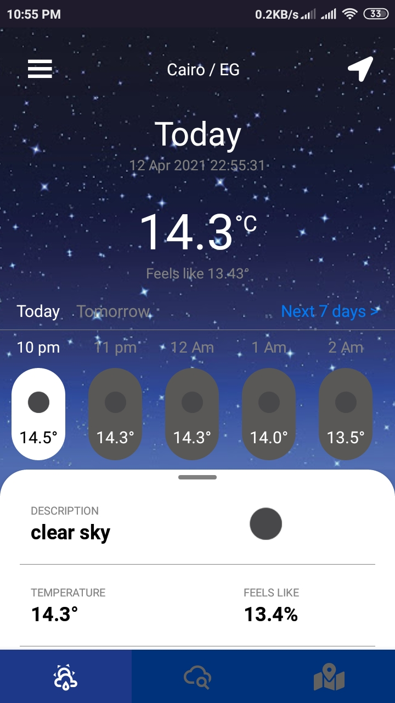
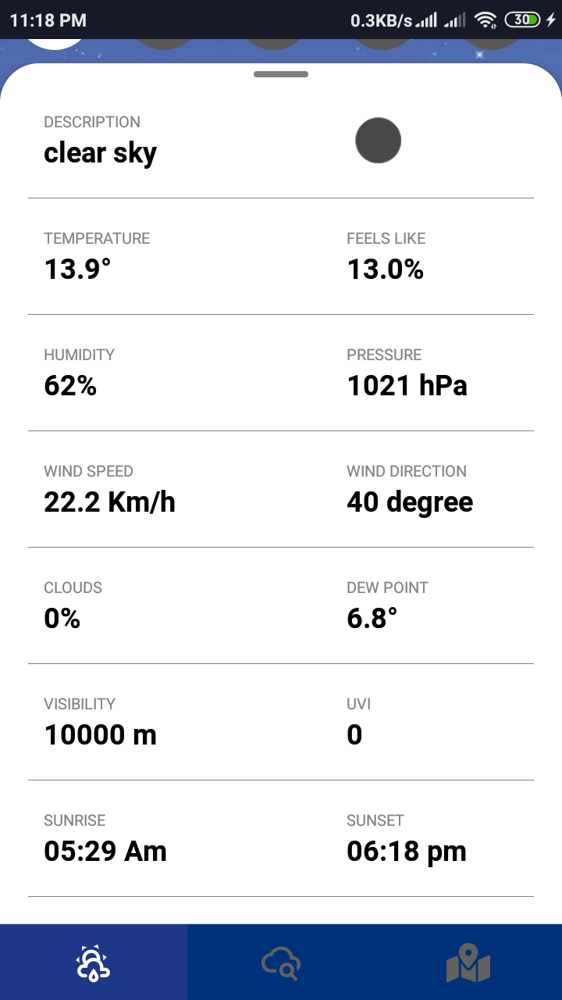
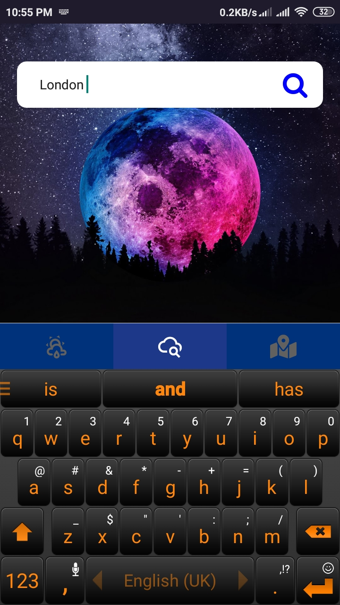
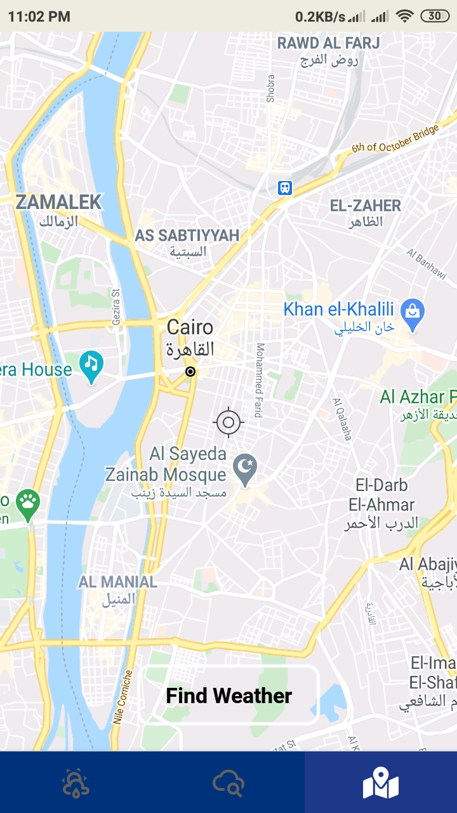
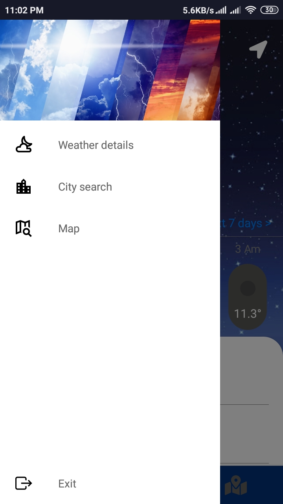

#Weather Forecast
you will be able to find out about the weather forecast and related information wherever you are, This happens via accessing live web data from the openWeatherMap API.

- Loading Screen:
determine the current location and get its Weather Data.

 

- Weather Screen: 
it show the current, hourly and daily weather and its details.

 
 

- Search Screen: 
you can search by any city u want and get its weather details

 

- Map Screen:
get the weather for any place from the map

 

 - Drawer: 
simple drawer with beautiful UI

 